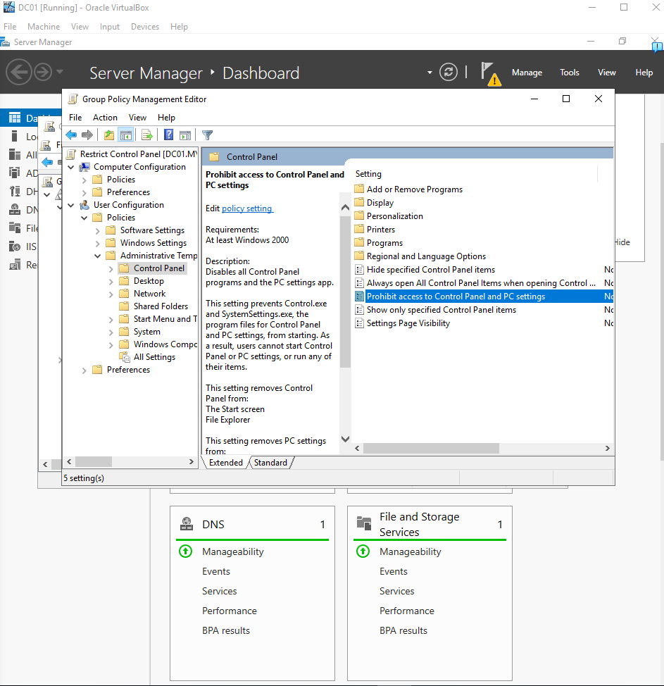
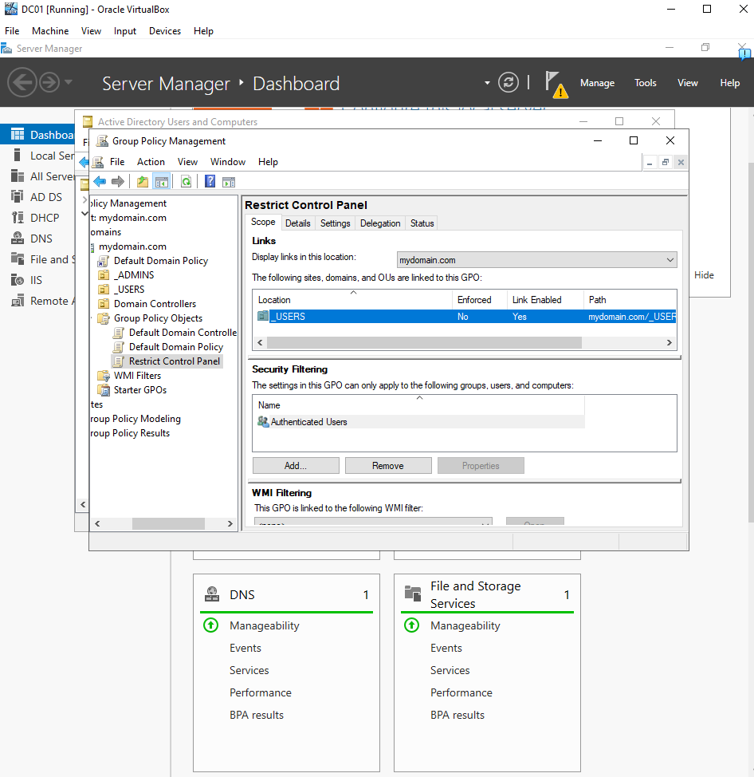
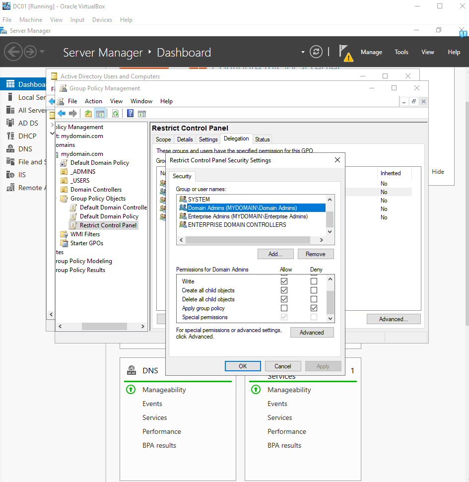
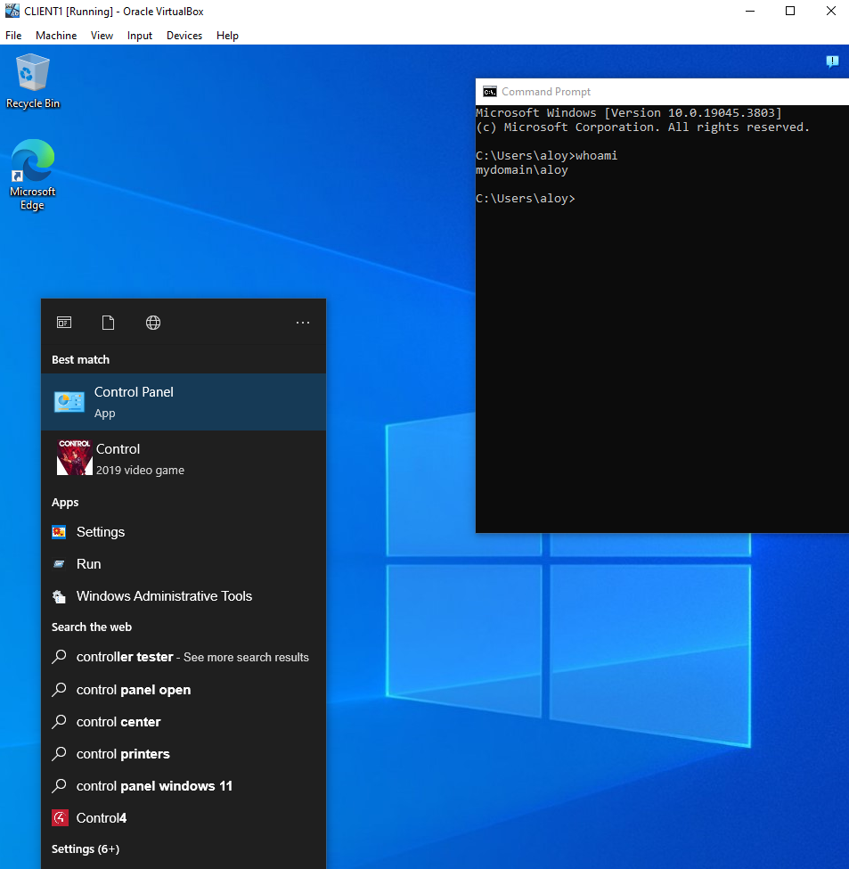
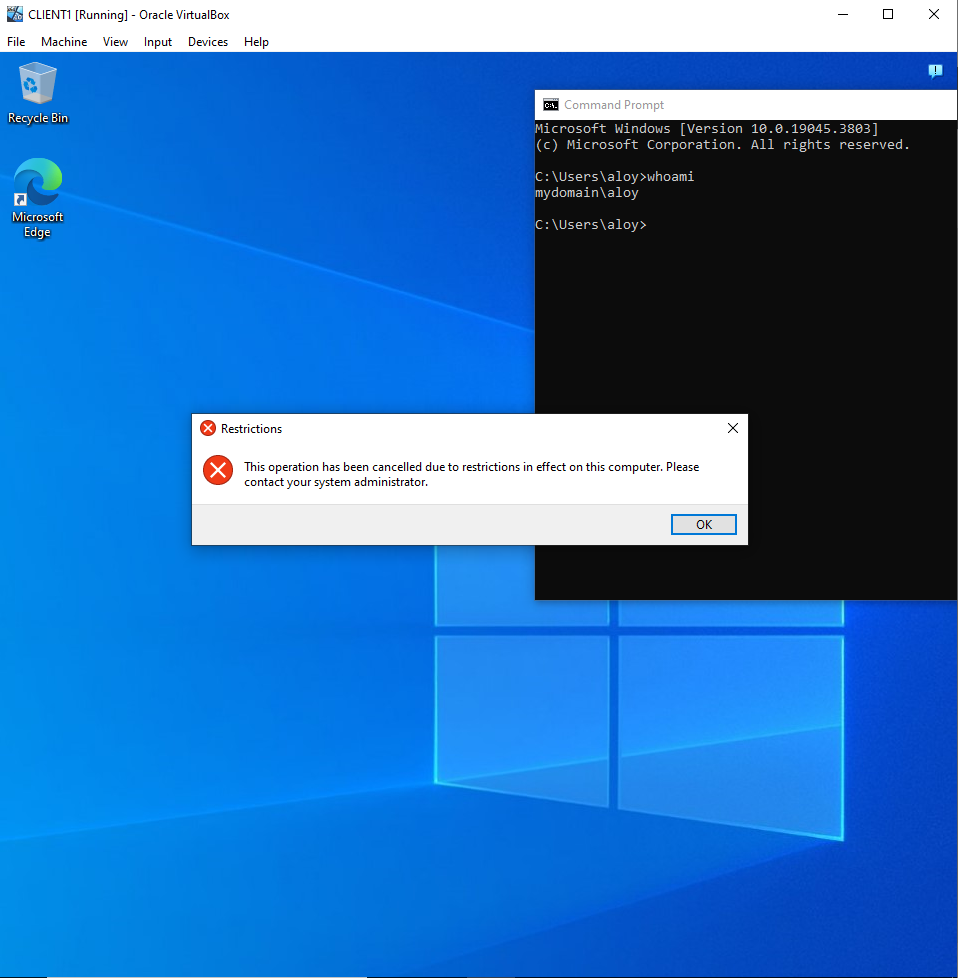
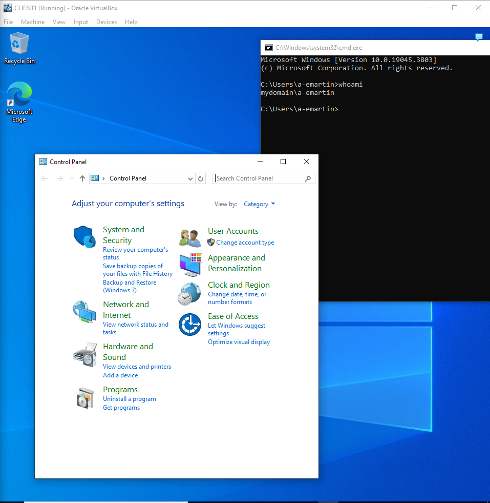
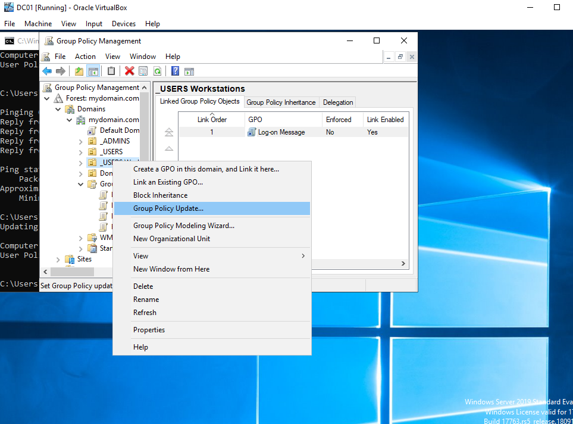

# Active-Directory-Lab
Active Directory home lab demonstrating Windows Server administration, user management, DNS, DHCP, and Group Policy.
# Goals
### Set up a domain controller with Active Directory, DHCP, and DNS.
### Disable the control panel for members of an Organizational Group called _USERS using Group Policy, and a message for any user who logs onto a PC in the Organizational Group called _USERS Workstations. Users and hosts not in either group will be unaffected. 

# Details and screenshots
### Domain Controller DC01 and its services:

The services that DC01 is running include Active Directory, DHCP, and DNS.

### DHCP was configured on DC01 to automatically assign IP addresses to domain clients. CLIENT1 successfully received an address within the configured scope:

### The DNS records show DC01 and CLIENT1 in lookup zones:

### DNS is able to resolve both DC01 and CLIENT1's request to ping each other, so we know it is working:

The firewall rule "File and Printer Sharing (Echo Request)" was disabled for Domains preventing DC01 sending packets to CLIENT1. However, after enabling this rule on CLIENT1 the packets sent successfully.

### The Organizational Units _ADMINS, _USERS, and Domain Controllers were created and 1000 Users were added to the _USERS group using a PowerShell script and a text file with 1000 random names.

### Implementing the first Group Policy which needs to disable the control panel for members of the _USERS OU.

### We don't want this to apply to Domain Admins, so the GPO is set to Deny for Apply group policy:

### Now on the client machine aloy, a member of the _USERS OU, tries to open the control panel but fails:

### And for a-emartin, a member of Domain Admins is able to open the control panel:

This GPO is functioning properly. 

### For the logon message for the computers of _USERS Workstations OU, I wrote a legal notice that activity on the computer can be recorded.

