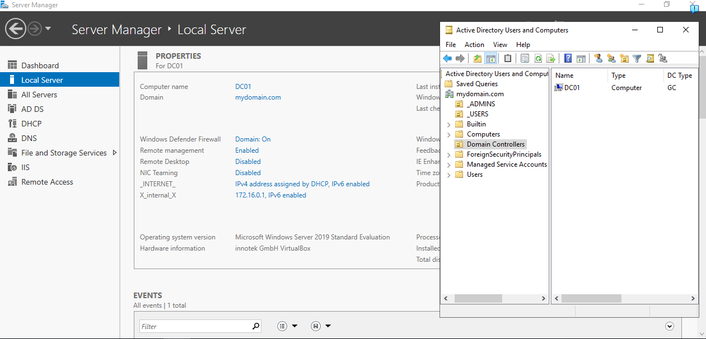
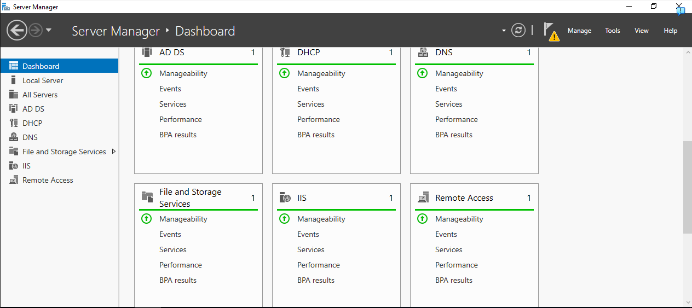
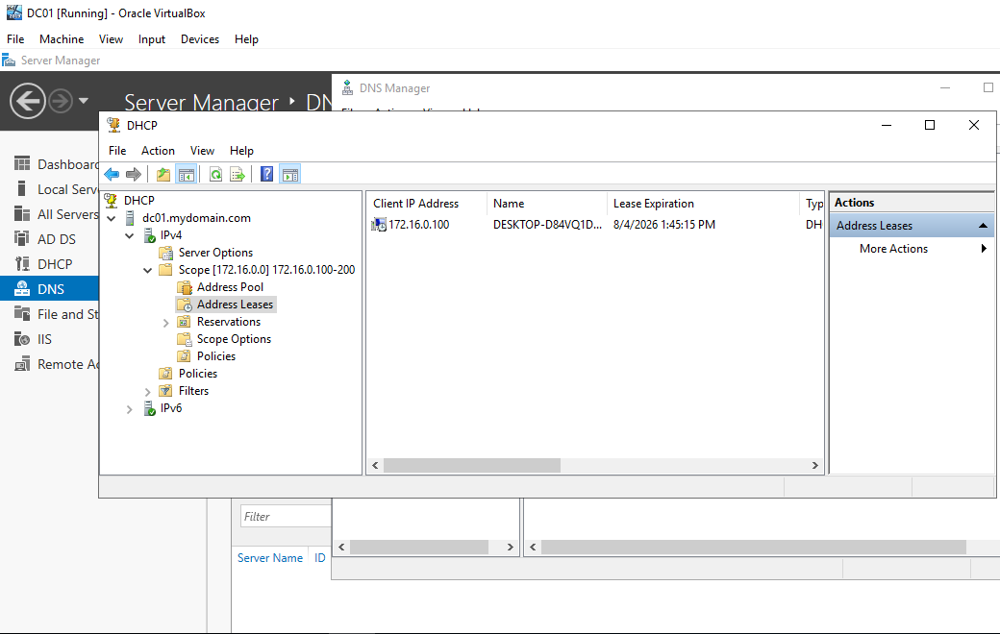
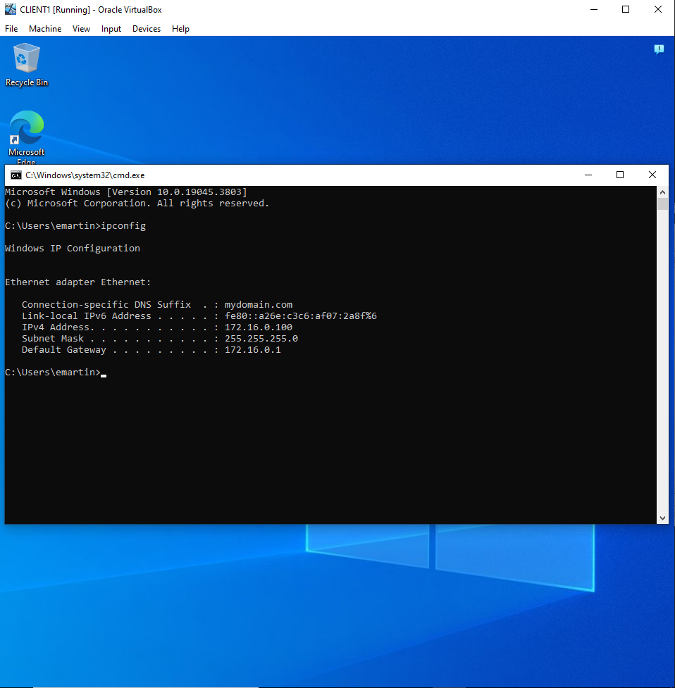
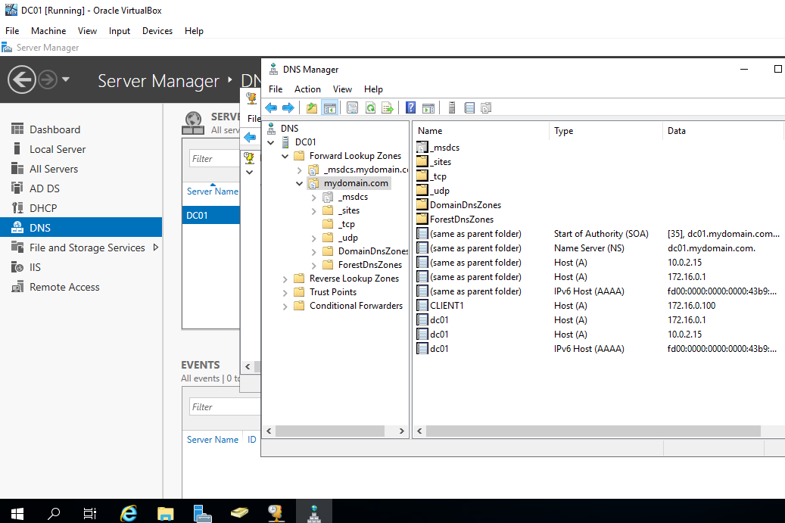
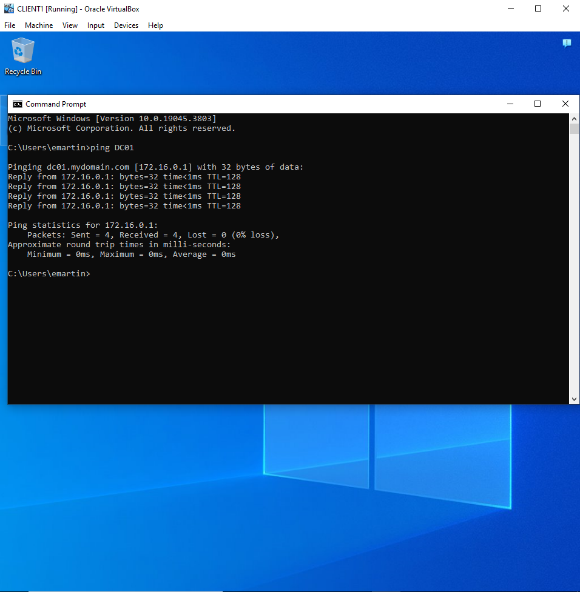
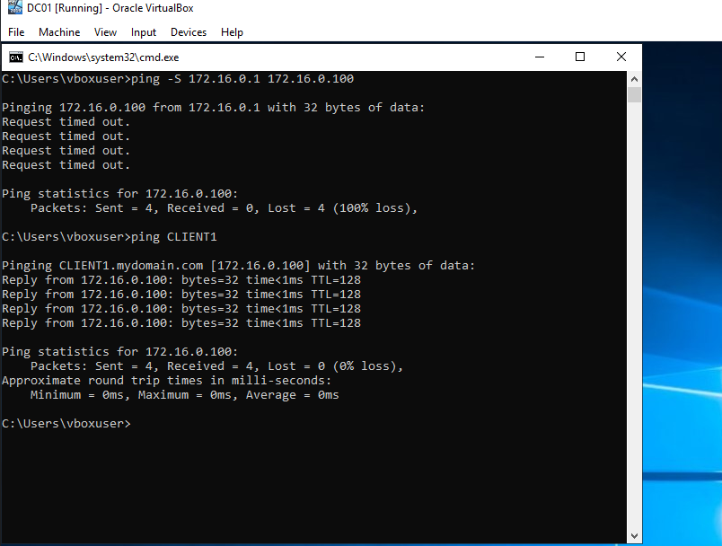
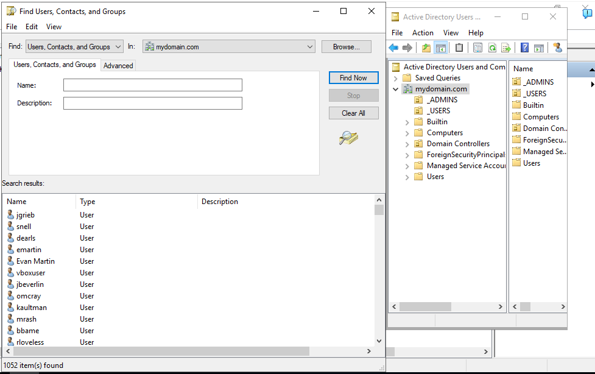

# Active-Directory-Lab
Active Directory home lab demonstrating Windows Server administration, user management, DNS, DHCP, and Group Policy.
# Goals
### Set up a domain controller running Active Directory, DHCP, and DNS.
# Details and screenshots
### Domain Controller DC01 and its services:

The services that DC01 is running include Active Directory, DHCP, DNS, and Remote Access.

### DHCP was configured on DC01 to automatically assign IP addresses to domain clients. CLIENT1 successfully received an address within the configured scope:

### The DNS records show DC01 and CLIENT1 in lookup zones:

### DNS is able to resolve both DC01 and CLIENT1's request to ping each other, so we know it is working:

The firewall rule "File and Printer Sharing (Echo Request)" was disabled for Domains preventing DC01 sending packets to CLIENT1. However, after enabling this rule on CLIENT1 the packets sent successfully.

### The Organizational Units _ADMINS, _USERS, and Domain Controllers were created and 1000 Users were added to the _USERS group using a PowerShell script and a text file with 1000 random names.

