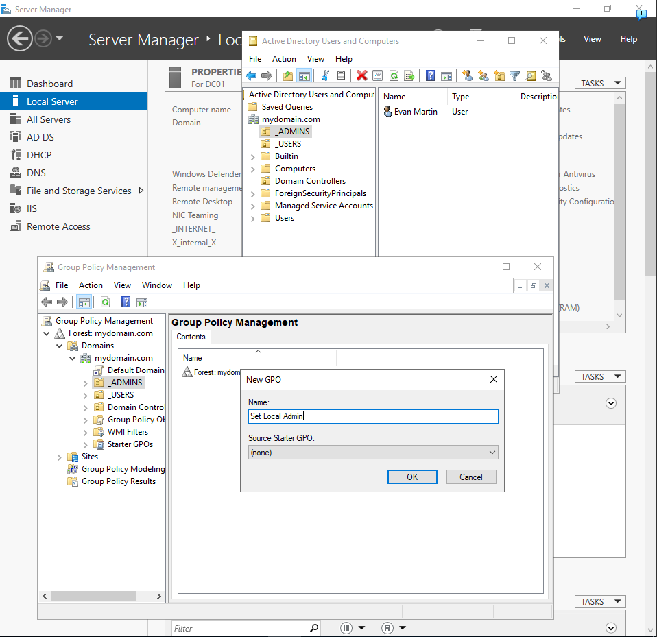
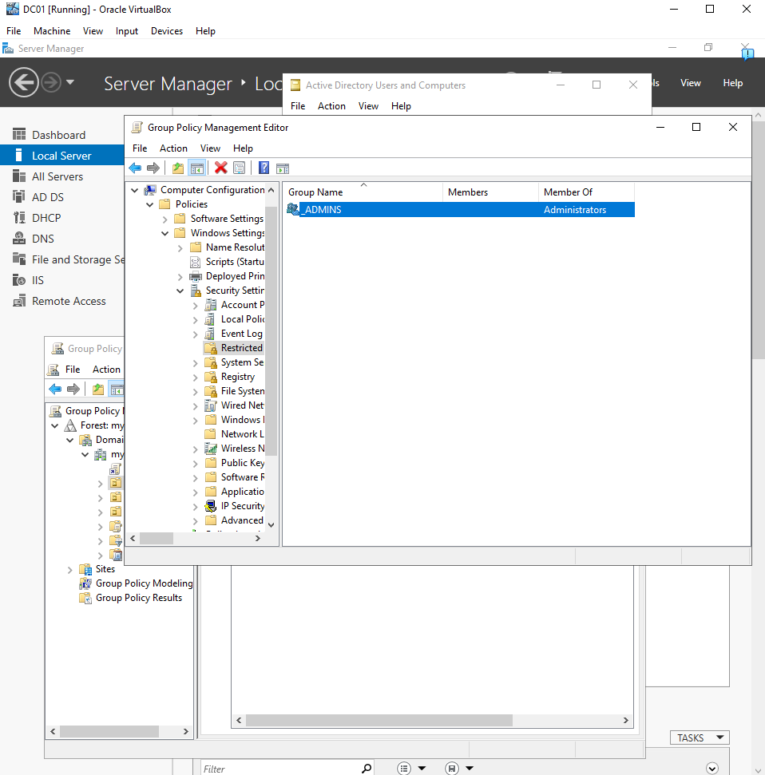
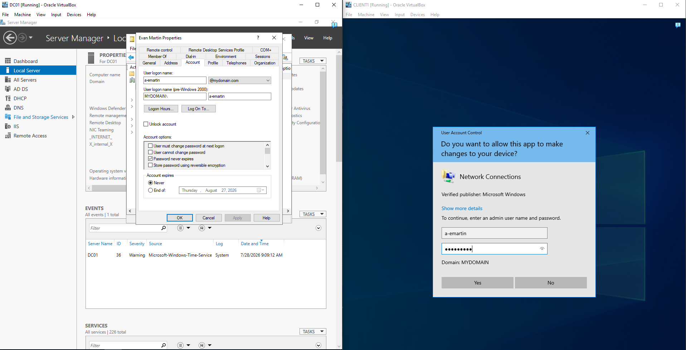
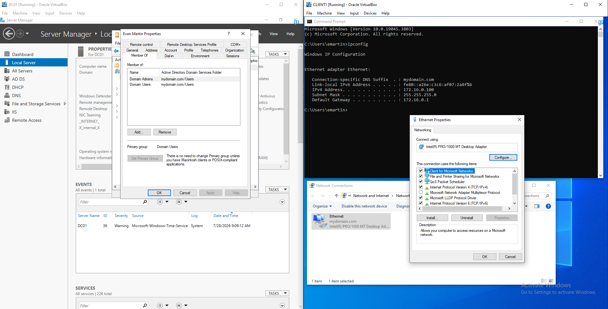

# Active-Directory-Lab
Active Directory home lab demonstrating Windows Server administration, user management, DNS, DHCP, and Group Policy.
# Details and screenshots
## Domain Controller DC01 and its services:

The services that DC01 is running include Active Directory, DHCP, DNS, and Remote Access and this project uses all of these.

### DHCP was configured on DC01 to automatically assign IP addresses to domain clients. CLIENT1 successfully received an address within the configured scope.

## The DNS records reflect that everything is working

## 1000 Users were added to the domain using powershell including CLIENT01's current user emartin.

## Promoting _ADMINS OU (which contains a second Evan Martin user) to gain admin privileges using a GPO

## The following two screenshots show the privilege elevation in action

Attempting to open the client's network adapter properties requires elevated access, let's see a-emartin the sole member of the _ADMINS OU is able to login. 

The login worked, a-emartin was able to sign in.
